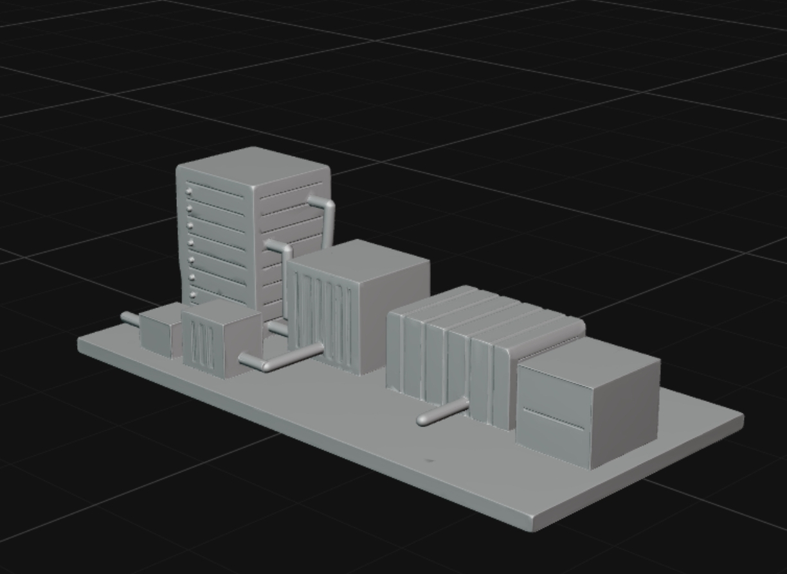

# 🌊 AQUA-SERVER | VentureHack 2026

> **Трек:** Open Innovation  
> **Концепт:** Превращение избыточного тепла AI-дата-центров в ресурс для опреснения морской воды.

## 💡 Вдохновение и проблема
Стремительное развитие искусственного интеллекта (AI) требует колоссальных вычислительных мощностей. Современные AI-дата-центры потребляют огромное количество энергии и выделяют гигаватты теплобкоторое сейчас просто «выбрасывается» в атмосферу системами охлаждения. 

В то же время планета сталкивается с дефицитом пресной воды. Морская вода доступна в избытке, но её опреснение требует огромных энергозатрат.

**Идея AQUA-SERVER:** Соединить эти две глобальные проблемы. Мы предлагаем не утилизировать тепло серверов, а использовать его как главный драйвер для термического опреснения воды.

---

## 🚀 Что такое AQUA-SERVER
**AQUA-SERVER** — это теоретическая модель и архитектурный концепт энергоэффективной системы, объединяющей:
1. Вычислительный кластер (AI Data Center).
2. Двухконтурную систему жидкостного охлаждения.
3. Модуль мембранной дистилляции (MD).

---

## ⚙️ Как это работает (Архитектура системы)

Система разделена на два изолированных, но термодинамически связанных контура:

### 1. Контур охлаждения (Замкнутый)
* Охлаждающая жидкость циркулирует через серверные стойки, поглощая тепло работающих AI-процессоров.
* Нагретый теплоноситель направляется к изолированному теплообменнику, передает тепло морской воде и, охладившись, возвращается к серверам.

### 2. Контур опреснения (Водяной)
* Морская вода забирается насосами, проходит механическую фильтрацию и попадает в теплообменник.
* Нагретая морская вода направляется в камеру мембранной дистилляции, разделенную гидрофобной пористой мембраной.
* **Физика процесса:** За счет разницы температур (дельта T) и давления водяного пара между горячей и холодной сторонами, чистый водяной пар проходит через поры мембраны (соли и загрязнения остаются).
* На холодной стороне пар конденсируется, превращаясь в чистую пресную воду.

---

## 📊 Физико-математическая база модели
Эффективность системы и потенциальный объем получаемой воды рассчитываются на основе уравнения теплопередачи и термодинамики пара:

1. **Количество утилизируемого тепла:**
   Формула: Q = m * c * dT
   * Где:
     * Q — количество полученной тепловой энергии.
     * m — масса охлаждающей жидкости.
     * c — удельная теплоемкость жидкости.
     * dT — разность температур на входе и выходе из сервера.

2. **Драйвер дистилляции:**
   Скорость испарения напрямую зависит от градиента давления пара (дельта P), который создается разницей температур между горячей (нагреваемой сервером) и холодной сторонами мембраны. 

### Выявленные ограничения модели (Инженерные вызовы):
* **Потери энергии:** Теплопотери при транспортировке жидкости по трубам и через стенки теплообменника.
* **Температурный порог:** Необходимость поддержания стабильно высокой температуры чипов для эффективного испарения без вреда для кремниевых процессоров.
* **Паразитная нагрузка:** Затраты электроэнергии на работу насосов контура забортной воды и охлаждение конденсатора.

---
## 📐 Концептуальный 3D-макет (Low-Poly Mockup)

Для наглядной демонстрации взаимосвязи узлов мы разработали упрощенную трехмерную блок-схему системы AQUA-SERVER. Модель выполнена вручную в низкополигональном стиле с использованием базовых геометрических примитивов, чтобы показать принципиальную компоновку оборудования.

*Рисунок 1: Расположение блоков: Серверная стойка ➔ Теплообменник ➔ Модуль дистилляции ➔ Резервуар пресной воды.*
